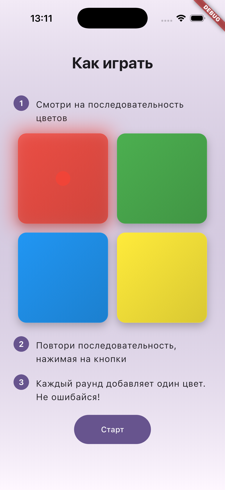
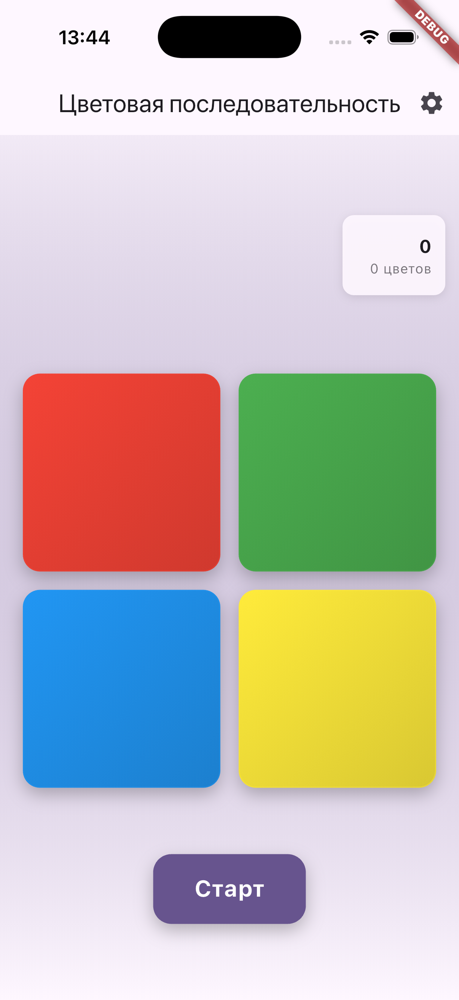
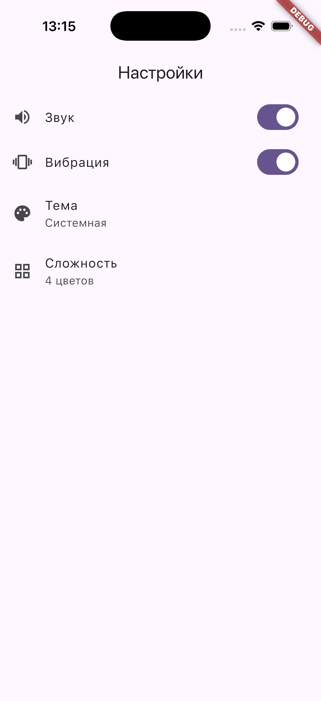

# tap_dash

**Игра с цветовой последовательностью** — игра на память в стиле «Саймон говорит» на Flutter. Следи за последовательностью цветных кнопок и повтори её. С каждым раундом добавляется ещё один цвет.

| Онбординг | Игра | Настройки |
|:---------:|:----:|:---------:|
|  |  |  |

## Возможности

- 4, 6 или 8 цветных кубиков (сложность настраивается в «Настройках»)
- Звуковая и тактильная отдача — нажми на кубики до старта, чтобы попробовать ксилофон
- Синтезированные ноты в стиле ксилофона для каждого цвета (демо-режим: звуки до начала игры)
- Празднование каждые 5 очков (значок + мелодия)
- Светлая/тёмная тема (по системе) и экран настроек (звук, вибрация, тема)
- Онбординг «Как играть» при первом запуске
- Локализация: русский и английский
- Платформы: iOS, Android, Web, macOS, Linux, Windows

## Быстрый старт

### Требования

- [Flutter SDK](https://docs.flutter.dev/get-started/install) (3.6.0+)
- Dart SDK ^3.6.0

### Установка

```bash
git clone <repository-url>
cd tap_dash
flutter pub get
```

### Запуск

```bash
# iOS Simulator (нужен Xcode, CocoaPods: brew install cocoapods)
./run_ios.sh
# или: DEVELOPER_DIR=/Applications/Xcode.app/Contents/Developer flutter run -d ios --debug

# Запуск на подключённом устройстве или эмуляторе
flutter run

# Сборка для релиза
flutter build apk      # Android
flutter build ios      # iOS
flutter build web      # Web
```

Скрипт `run_ios.sh` задаёт `DEVELOPER_DIR` для Xcode и запускает приложение в iOS Simulator в режиме отладки. Используй его, когда `flutter run -d ios` выдаёт ошибки из-за пути к Xcode.

### Тесты

```bash
flutter analyze
flutter test
flutter test --coverage   # Отчёт покрытия; требуется ≥89% для lib/
```

**Покрытие тестами:** для `lib/` должно быть не менее 89%. Запусти `flutter test --coverage` перед коммитом.

## Структура проекта

```
lib/
├── main.dart              # Точка входа, DI
├── screens/
│   ├── initial_screen.dart    # Маршрутизация (онбординг или игра при первом запуске)
│   ├── onboarding_screen.dart # «Как играть» (только первый запуск)
│   ├── game_screen.dart       # Основной экран игры
│   └── settings_screen.dart   # Настройки: звук, вибрация, тема
├── widgets/
│   ├── color_button.dart      # Кнопка цветной сетки
│   └── settings_tile.dart     # Строка настроек
├── services/
│   ├── audio_service.dart           # Синтез ксилофона
│   ├── game_stats_service.dart      # Рекорд, количество игр, флаг онбординга
│   ├── games_services_controller.dart # Game Center / Play Games (таблица лидеров)
│   └── settings_service.dart        # Звук, вибрация, тема
├── game/
│   └── game_state.dart       # Чистая игровая логика (тестируемая)
└── l10n/                    # Локализации (en, ru)
```

## Сборка для магазинов

**Android:**
- Релиз APK: `flutter build apk`
- App Bundle (Play Store): `flutter build appbundle`

**iOS:**
- Архив через Xcode: открой `ios/Runner.xcworkspace`, Product → Archive
- Или: `flutter build ios`, затем архив в Xcode

**Web:**
- `flutter build web` — результат в `build/web/`

## Решение проблем

| Проблема | Решение |
|----------|---------|
| Ошибка `flutter pub get` | Проверь Flutter в PATH; выполни `flutter doctor` |
| Ошибки iOS / CocoaPods | `cd ios && pod install && cd ..`; проверь Xcode CLI: `sudo xcode-select -s /Applications/Xcode.app` |
| Предупреждения `flutter analyze` | Исправь линты в `analysis_options.yaml`; выполни `dart format .` |
| Падают тесты | Запусти `flutter test --coverage`; проверь покрытие ≥89% для нового кода |

## Лицензия

См. [LICENSE](LICENSE).

---

[English](README.en.md)
